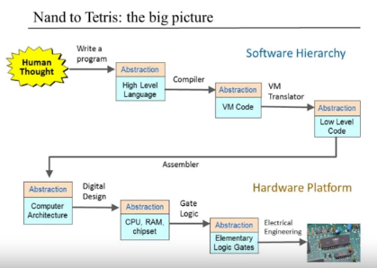
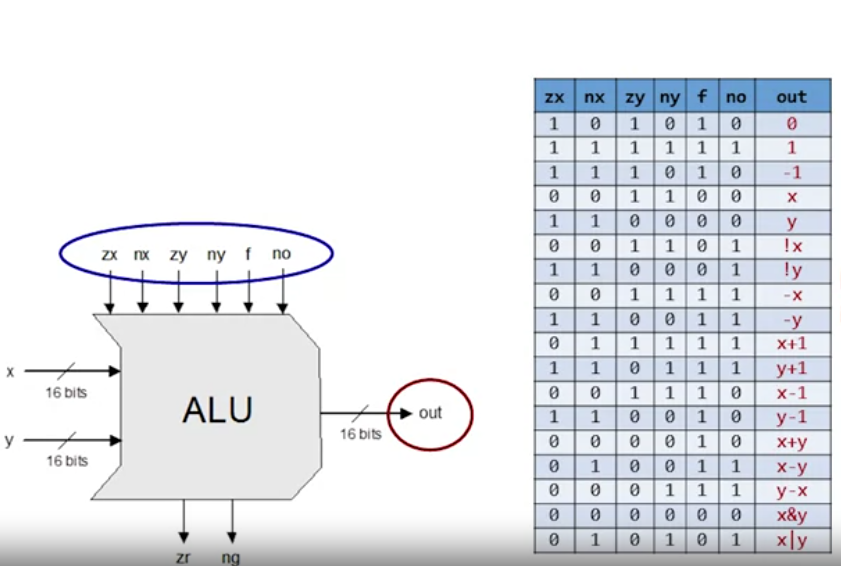

# Nand2Tetris


## Part-1 ( Hardware )

### Week 1  
_Brief - All about Boolean Logic, expressions and Logic Gates. Also a introduction to HDL, this course doesnt use Common HDLs in the market like ( Verilog, VHDL )_

Boolean variables - Variables signifying 0 (off) or 1 (on)
Boolean function - Function that operates on boolean variables and returns a boolean value. Ex - x And y, x Or y.

Logic Gates - Elementary componenents (electronic circuits) that represent boolean functions. Ex - And, Or, Nand, Xor.

HDL - Hardware Description Language, a declarative language for chip functionality design.

### Week 2 
_Brief - Binary numbers and operations on them. Combinational circuits and at last an ALU chip_

Binary Numbers can be used to represent Decimal Numbers. 
Ex - 110 => (2^2 * 1) + (2^1 * 1) + (2^0 * 0) = 6

With 8 bits we can represent 0-255 unsigned numbers
or if we represent negative numbers as well (using 2s complement), MSB( most significant bit ) is reserved for it.

Binary Addition - Just like normal addition ( sum and carry ) except we drop the overflow. 

```
    0 0 0 1 0 1 0 1
+   0 1 0 1 1 1 0 0  
    ---------------
    0 1 1 1 0 0 0 1
```

ALU (Arithmetic and Logical Unit) - Fundamental component used in CPU to perform arithmetic and bitwise operations on binary numbers. 


### Week 3

